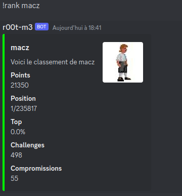

# Rootme-Bot

## Deploiment

Editer `token_config_bot.py` et `config.ini`

```bash
pip3 install -r requirements.txt
make
make clean
```

## Structure

```
Root-me-Bot/
.
├── Makefile
├── README.md
├── deploy.yml
├── rank.png
├── requirements.txt
└── src
    ├── bot.py
    ├── controller
    │   └── bot_controller.py
    ├── model
    │   ├── bot.sql
    │   ├── config.ini
    │   └── database.py
    └── view
        ├── rank.py
        └── token_config_bot.py
```

## Commandes

- !rank: affiche le rang de l'utilisateur
- !last: affiche les derniers challenges résolus
- !profile: affiche le profil selon les catégories résolues




